<!-- PROJECT SHIELDS -->
<!--
* I'm using markdown "reference style" links for readability.
* Reference links are enclosed in brackets [ ] instead of parentheses ( ).
* See the bottom of this document for the declaration of the reference variables
* for contributors-url, forks-url, etc. This is an optional, concise syntax you may use.
* https://www.markdownguide.org/basic-syntax/#reference-style-links
-->
[![Contributors][contributors-shield]][contributors-url]
[![Forks][forks-shield]][forks-url]
[![Stargazers][stars-shield]][stars-url]
[![Issues][issues-shield]][issues-url]
[![MIT License][license-shield]][license-url]

# Things To Do

> Personal To-Do app project aimed practice intermediate Kotlin concepts. Such as Room Database, Shared Preferences, Notifications, Work Manager, Dagger-Hilt, Alarm Manager, Navigation, App Theming etc

## Built With

- Kotlin

### Things To Do
Generally the creators purpose was to develope a ToDo List Application employing various android concepts during his learning expedition; making this a long term project.

It is therefore bound to grow in complexity with improves to performance, functionality and others, with time. 

> Below are some of the major targets the creator has been able to come up with time. And the list keeps on growing!
- [X] Implement theme switching with shared preference
- [X] Employ Dependency Injection
- [X] Show notifcations 30 minutes before due time
- [X] Migrate to Android 12 splash screen API. *Yet to know how to sync theme with shared pref
- [X] Properly Adopt Material Theming
- [X] Write Unit and Instrumented Tests
- [ ] Dynamically display due and overdue tasks
- [ ] Sync notifications with done and undone tasks
- [ ] Enable undo delete using snackbar
- [ ] Better display time
- [ ] Migrate to Jetpack Compose
- [ ] Implemented DI for Instrumented Tests and Action bar UI Tests

## Screenshots
### Light
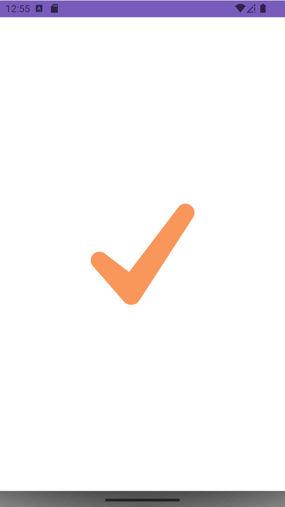 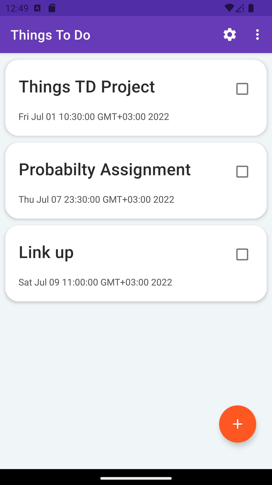 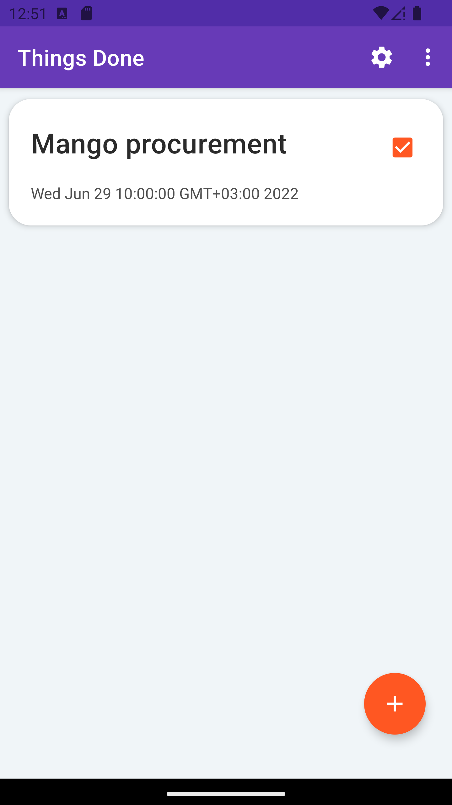
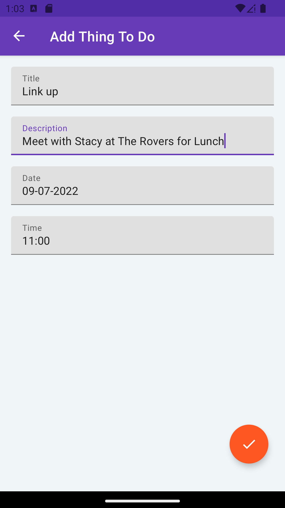 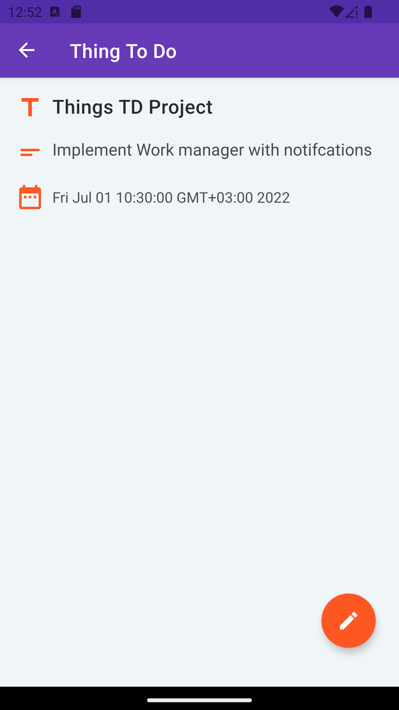 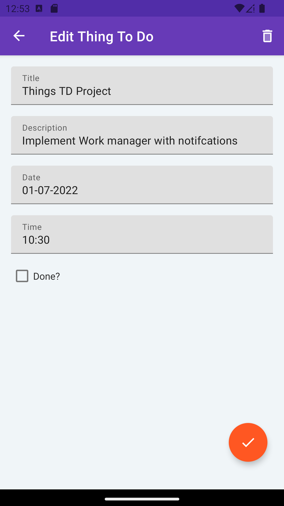
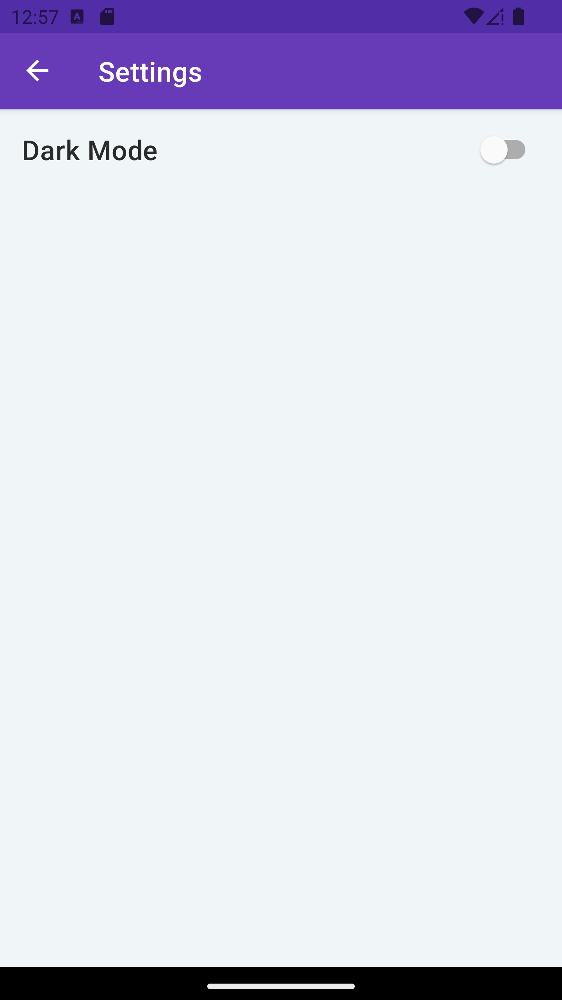

### Dark
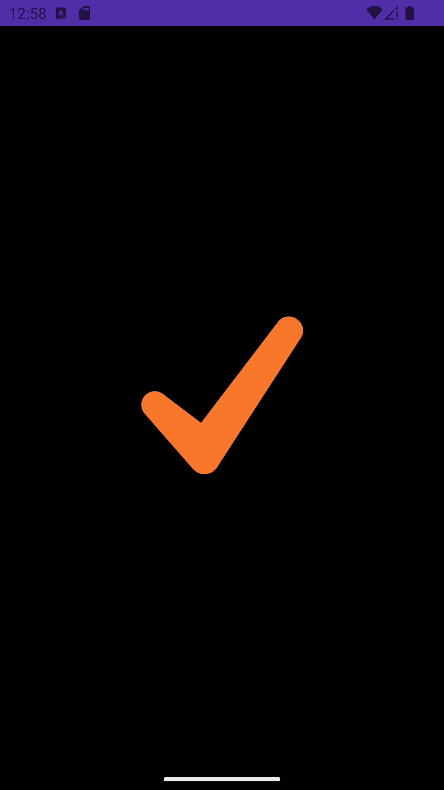 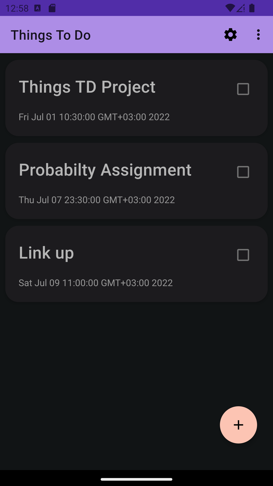 
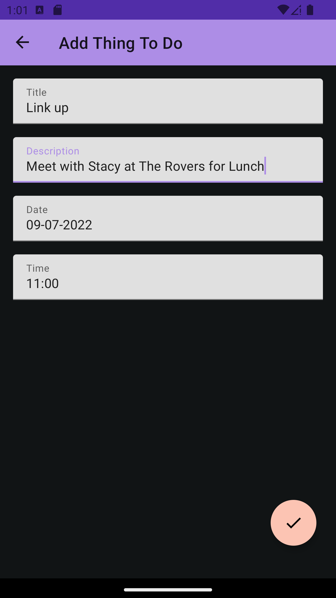 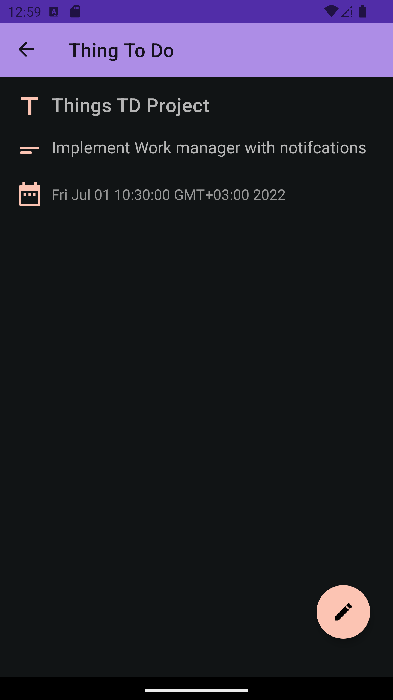 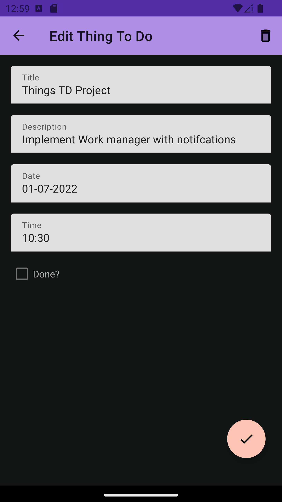
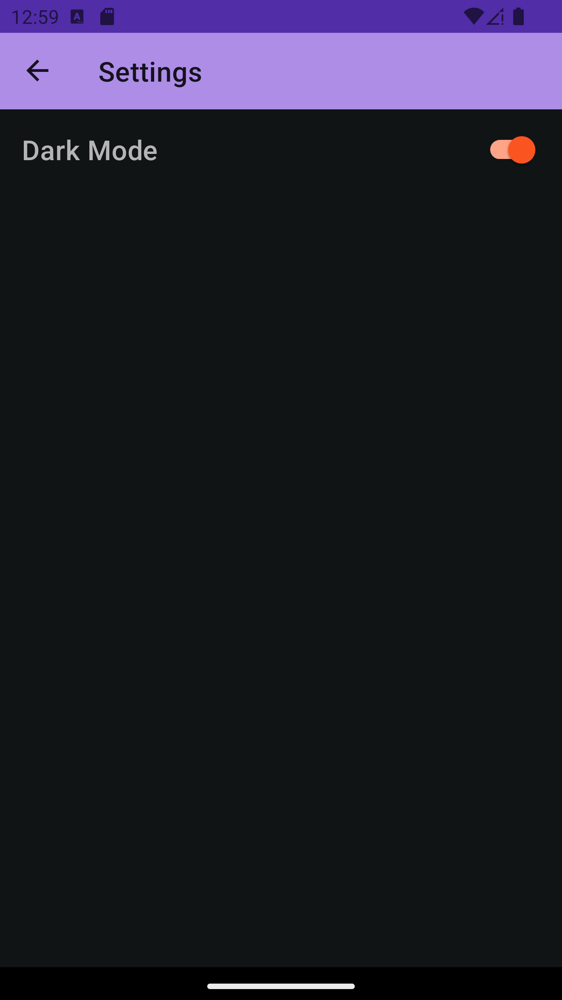

## Getting Started

To get a local copy up and running follow these simple example steps.

### Prerequisites
-  Installed Android Studio or Any other android development IDEs and their respective dependencies

## 🤝 Contributing

Contributions, issues, and feature requests are welcome!
You can pick a thing to do from the list provided above and work on it.

Feel free to check the [issues page](../../issues/) or [discussions page](../../discussions).

## Show your support

Give a ⭐ if you like this project!

## Acknowledgments

-

## 📝 License

This project is [MIT](./MIT.md) licensed.

<!-- MARKDOWN LINKS & IMAGES -->
<!-- https://www.markdownguide.org/basic-syntax/#reference-style-links -->
[contributors-shield]: https://img.shields.io/github/contributors/RyanKoech/ThingsToDo.svg?style=for-the-badge
[contributors-url]: https://github.com/RyanKoech/ThingsToDo/graphs/contributors
[forks-shield]: https://img.shields.io/github/forks/RyanKoech/ThingsToDo.svg?style=for-the-badge
[forks-url]: https://github.com/RyanKoech/ThingsToDo/network/members
[stars-shield]: https://img.shields.io/github/stars/RyanKoech/ThingsToDo.svg?style=for-the-badge
[stars-url]: https://github.com/RyanKoech/ThingsToDo/stargazers
[issues-shield]: https://img.shields.io/github/issues/RyanKoech/ThingsToDo.svg?style=for-the-badge
[issues-url]: https://github.com/RyanKoech/ThingsToDo/issues
[license-shield]: https://img.shields.io/github/license/RyanKoech/Crypto_Fund.svg?style=for-the-badge
[license-url]: https://github.com/RyanKoech/ThingsToDo/blob/master/LICENSE
